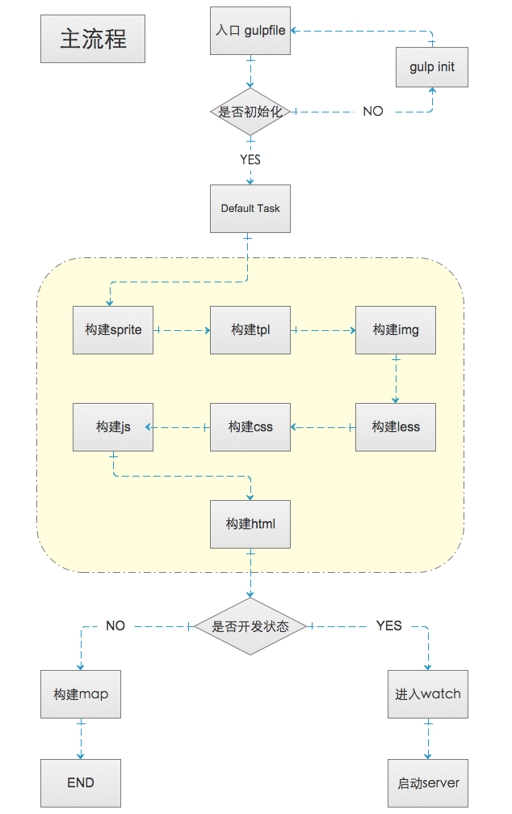

# v.builder

这是一个基于`gulp`的前端工程化框架，一个`页面级`的前端模块化开发、调试、发布及迭代的整体解决方案。

================

by Pang.J.G

## v.builder的起源

### 设计理念
为什么要开发`v.builder`？它解决的是什么问题？
(未完待续)

### 主要功能
(未完待续)

=======================
## 部署 v.builder

### 下载
```
git clone https://github.com/lmtdit/v.builder.git
```

### 配置
根目录下创建 `config.json` 文件，内容如下
```JSON
{
    "paths": {
        "src": "src",
        "debug": "debug",
        "dist": "dist",
        "map": "dist/map"
    },
    "viewPath": "./views/",
    "coreJs": {
        "mods": [
            "jquery",
            "vmcore"
        ],
        "name": "corelibs"
    },
    "fontExt": [
        "eot",
        "svg",
        "ttf",
        "woff"
    ],
    "prefix": "combo",
    "spaceName": "_LIB_",
    "hashLen": 10,
    "cdnDomain": "",
    "version": "2.1.6",
    "host": "localhost",
    "port": "8800",
    "openBrower": false
}
```

### 初始化

```
gulp init
```

### 开发

```
gulp
// or
gulp --e local
```

### 发布

```
//发布到测试环境
gulp --e test

//发布到预生产环境
gulp --e pre

//发布到生产环境
gulp --e www
```

=======================

## 使用说明及规范

### 核心构建流程

(未完待续)

### 雪碧图构建流程及开发说明
(未完待续)

### CSS构建流程及开发说明
(未完待续)

#### CSS和HTML模块化开发规范
(未完待续)

### JS构建流程及开发说明
(未完待续)

#### JS模块化开发规范
(未完待续)

### 静态html开发说明

#### html目录规范
(未完待续)

#### html模板语法

1. @@include包含子模板，子模板为相对路径，可以传参

2. 参数通过 <@- 参数名 @> 来实例

vbuilder中包含的html模板引擎，实际上是在ejs模板引擎语法上进行的二次封装，此框架设定的ejs模板标志为 `@`

例如：当参数名字为`css`，值为 `common.css,index.css`，那么，在`local`开发环境下 `<@- css @>` 将被实例为如下的html

```HTML
<link href='//localhost:8800/debug/css/common.css?v=2.1.6&t=14588093' rel='stylesheet' type='text/css' />
<link href='//localhost:8800/debug/css/index.css?v=2.1.6&t=14588093' rel='stylesheet' type='text/css' />
<script>
    var STATIC_PATH = '//localhost:8800/debug/',
        _LIB_ = window['_LIB_'] = {},
        _VM_ = window['_VM_'] = {};
    _LIB_.getStaticUri = {
        img: function(n) {
            return STATIC_PATH + 'img/' + n;
        },
        css: function(n) {
            return STATIC_PATH + 'css/' + n;
        },
        js: function(n) {
            return STATIC_PATH + 'js/' + n
        }
    };
</script>
```

由于css被实例时，会附带全局的javascript的静态域名变量以及两个全局命名空间，这些变量会在javascript模块化构建中使用，因此在一个页面中只需要进行一次css文件实例即可。


(未完待续)

#### eg:
```
//这是主模板的内容-->
@@include("./_common/head.html",{
        "title":"后台管理",
        "css":"pintuer.css,admin.css"
    })
@@include("./_common/footer.html",{
     "js":"jquery.js,pintuer.js,respond.js,admin.js"
})

//这是子模板的内容-->
<title><@-title@></title>
<!-- css -->
<@- css @>
<!-- /css -->
<link type="image/x-icon" href="/favicon.ico" rel="shortcut icon" />
<link href="/favicon.ico" rel="bookmark icon" />
<body>
    " alt="">
    " alt="">
</body>
```
#### 静态html模块化开发的建议：
(未完待续)

## License

MIT.
